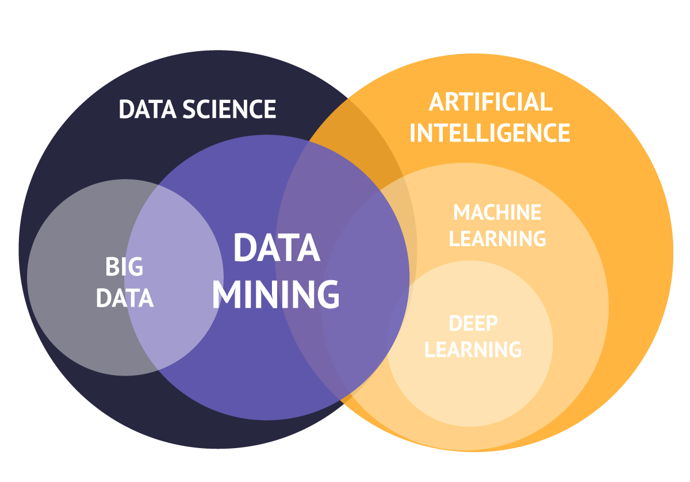

# EE6483 Artificial Intelligence and Data Mining

# 1.Introduction

This course offers a concise overview of the core theories and techniques in both **Artificial Intelligence** and **Data Mining**, emphasizing **state space representation and search strategies, association rule mining, supervised and unsupervised learning, neural networks, and clustering**. By exploring these methods and their real-world **applications**, students will acquire practical skills to tackle complex problems and uncover valuable insights from data.

This repository serves as a comprehensive resource for students and enthusiasts alike. 

1. **Personal Solutions to Past Exams** – Detailed, step-by-step write-ups of previously tested questions to guide your revision and deepen conceptual understanding.
2. **PPT Example References** – Walkthroughs of example problems and exercises presented in the lecture slides, clarifying key ideas and methodologies.
3. **Analysis of Challenging Topics** – In-depth discussions and breakdowns of complex areas, helping you navigate common pitfalls and master advanced concepts.

If you happen to have a GitHub account and find this repository helpful, **please consider giving it a star⭐**.



# 2.**Course Aims**

This course introduces the fundamental theory and concepts of **Artificial intelligence (AI)** and **Data Mining** methods, in particular **state space representation** and **search strategies, association rule mining, supervised learning, classifiers, neural networks, unsupervised learning, clustering analysis**, and their applications in the area of Artificial Intelligence and Data Mining. This can be summarized as: 

1. To understand the concepts of knowledge representation for state space search, strategies for the search. 
2. To understand the basics of a data mining paradigm known as Association Rule Mining and its application to knowledge discovery problems. 
3. To understand the fundamental theory and concepts of supervised learning, unsupervised learning, neural networks, several learning paradigms and its applications

# 3.Course Content

Structures and Strategies for State Space Representation & Search. 

Heuristic Search. 

Data Mining Concepts and Algorithms. 

Classification and Prediction methods. 

Unsupervised Learning and Clustering Analysis.

# 4.Reading and References

## 4.1Textbooks

1. Luger George F, Artificial Intelligence : Structures and Strategies for Complex Problem Solving, 

6 th Edition, Addison-Wesley, 2009. (Q335.L951)

2. Pang-Ning Tan, Michael Steinbach, Vipin Kumar, Introduction to Data Mining: Pearson 2nd Edition, 

2019.

3. Ian Goodfellow, Yoshua Bengio and Aaron Courville, Deep Learning, MIT Press, 2016. ISBN: 978-

0262035613 (Q325.5.G651)

## 4.2 References

1. Jiawei Han, Micheline Kamber and Jian Pei, Data Mining: Concepts and Techniques, 3rd Edition, 

Morgan Kaufmann, 2011, ISBN: 978-0-12-381479-1.

2. S. Russell and P. Norvig, Artificial Intelligence -A Modern Approach, 4th Edition, Prentice Hall, 
3. Kevin P. Murphy, Probabilistic Machine Learning- An Introduction, The MIT Press, 2022.
5. Christopher M. Bishop, Pattern Recognition and Machine Learning, Springer, 2006


# 5.Content in Chinese

### Dr. CHEN Lihui

0.每周计划

1.人工智能历史应用简介

1.1什么是人工智能?

1.2为什么AI

1.3共同目标

1.4简史

1.5应用

1.6 总结


2.搜索的结构和策略

2.1知识表示

2.1.1 符号人工智能

2.1.2用搜索算法解决问题

2.1.3知识表示

2.1.3.1示例:农夫过河

2.1.3.2示例:8 谜题

2.1.3.3示例:柯尼斯堡的桥梁问题

2.1.4图

2.1.5树

2.1.6状态空间搜索

2.1.6.1四元组 [N, A, S, GD]

2.1.6.2解决路径

2.1.6.3例子:15 个拼图和8 个拼图

2.1.6.4练习1:两个水壶问题

2.1.6.5例子:旅行商问题(TSP)


2.2搜索策略

2.2.1数据驱动与目标驱动

2.2.1.1数据驱动的搜索

2.2.1.2目标驱动的搜索

2.2.1.3异同

2.2.1.4混合

2.2.1.5示例:后裔

2.2.1.6总结:L2 & L3

2.2.1.7练习 2:数据还是目标


2.2.2图搜索的实现

2.2.2.1为什么要搜索图表

2.2.2.2回溯搜索

2.2.2.2.1回溯的符号

2.2.2.2.2回溯程序

2.2.2.2.3每个节点递归

2.2.2.2.4回溯中使用的主要思想

2.2.2.2.5回溯算法

2.2.2.2.6回湖示例

2.2.2.2.7练习 3:在图上回溯


2.2.2.3 BFS 广度优先搜索

2.2.2.3.1 广度优先搜索的实现

2.2.2.3.2广度优先搜索算法

2.2.2.3.3 示例:广度优先搜索

2.2.2.3.4 总结

2.2.2.3.5 广度优先搜索:开和闭

2.2.2.3.6广度优先搜索的限制


2.2.2.4 DFS 深度优先搜索

2.2.2.4.1 深度优先搜索

2.2.2.4.2另一种实现

2.2.2.4.3实现

2.2.2.4.4算法

2.2.2.4.5示例:深度优先搜索

2.2.2.4.6替代实现


2.2.2.5广度优先和深度优先对比


2.2.2.6 DFS-ID 迭代深化的深度优先搜索

2.2.2.7练习 4：广度和深度


2.3总结


3.启发式搜索游戏

3.1搜索策略

3.1.1不知情与知情的搜索策略

3.2简介:启发式搜索

3.3为什么采用启发式方法?

3.3.1局限性

3.3.2两个关键组成部分

3.3.3井字棋示例

3.4启发式搜索算法

3.4.1爬山

3.4.1.1爬山:最简单的方法

3.4.1.2局限性

3.4.1.3公约

3.4.1.4 爬山示例

3.4.2最佳优先搜索

3.4.2.1最佳优先算法

3.4.2.2最佳优先示例

3.4.2.3 总结

3.4.3示例:设计启发式方法

3.4.4设计启发法

3.4.5最佳搜索

3.4.5.1贪婪最佳搜索

3.4.5.2 A星算法

3.4.5.3示例

3.4.5.3.1示例：最佳搜索 8 个拼图

3.4.5.3.2示例:对比

3.4.5.3.3示例:贪心路径

3.4.5.3.4示例:A星路径

3.4.5.4贪婪最佳优先与 A*的性质

3.4.5.5练习题

3.4.5.6总结

3.4.5.7练习 3 启发法

3.4.5.8总结


3.5 启发式搜索和游戏

3.5.1搜索与游戏

3.5.2游戏和人工智能

3.5.2.1游戏树

3.5.2.2游戏作为搜索问题

3.5.2.3示例:井字游戏的一棵游戏树

3.5.3极小极大算法

3.5.3.1游戏中的启发式方法

3.5.3.2示例:NIM 游戏

3.5.3.3示例:x=7时的 nim 游戏

3.5.3.4极小极大算法贝

3.5.3.5策略

3.5.3.6示例:nim 游戏的极小极大

3.5.3.7示例:井字棋的极小极大

3.5.3.8性质

3.5.3.9练习 4:在图 4所示的树上执行极小极大


3.5.4 Alpha-Beta 算法

3.5.4.1beta 截止

3.5.4.2alpha 截止

3.5.4.3总结

3.5.4.4关键思想

3.5.4.5法 α

3.5.4.6示例:极小极大决策

3.5.4.7示例:Alpha-Beta 修剪

3.5.4.8练习5和 6

3.5.4.9例6:从左到右

3.5.4.10性质

3.5.4.11蒙特卡罗树搜算

3.5.4.12总结


4.数据挖掘与关联分析简介

4.1 数据挖掘简介

4.1.1什么是数据?

4.1.1.1数据矩阵

4.1.1.2交易数据

4.1.1.3图数据，基因组序列数据

4.1.1.4数据，信息，知识

4.1.1.5数据，信息，知识，智慧

4.1.2什么是数据挖掘?

4.1.2.1讨论:以下活动中的哪一项是数据挖掘任务

4.1.2.2商业智能中的数据挖掘

4.1.2.3数据库中的知识发现流程:从机器学习和统计学角度的典型视图

4.1.3数据挖掘任务

4.1.4数据挖掘类型=关键功能

4.1.4.1挖掘哪些类型的数据?

4.1.5数据挖掘应用

4.1.5.1架构:典型数据挖掘系统

4.1.5.2数据挖掘的主要问题

4.1.6练习4.1


4.2关联分析


4.3额外材料


### Prof Tan Yap Peng

0.一般信息

1.机器学习简介

2.分类和决策树

3.最近邻分类器和支持向量机

4.神经网络

5.附加练习作业和解答

### Asst Prof Wen Bihan

0.迷你项目

1.聚类和回归

2.正则化和优化

3.PCA 和贝叶斯推理

4.总结和更多示例-之前

5.总结和更多示例

6.稀疏编码 不考

# 6.List of GitHub

```
├─1.Exam
│      .keep
│      
├─2.PPT Example
│      2.1.6.4练习1两个水壶问题.pdf
│      2.2.1.7练习 2数据还是目标.pdf
│      2.2.2.2.6回溯示例.pdf
│      2.2.2.2.7练习 3 在图上回溯.pdf
│      2.2.2.3.3 示例：广度优先搜索-v2.pdf
│      2.2.2.4.5示例 深度优先搜索-v2.pdf
│      2.2.2.7练习 4：广度和深度.pdf
│      3.4.2.2最佳优先示例-v2.pdf
│      3.4.3示例：设计启发式方法.pdf
│      3.4.5.3.1示例：最佳搜索 8 个拼图.pdf
│      3.4.5.3.3示例：贪心路径.pdf
│      3.4.5.3.4示例：A星路径.pdf
│      3.4.5.5练习题.pdf
│      3.5.3.6示例：nim 游戏的极小极大.pdf
│      3.5.3.7示例：井字棋的极小极大-Q.pdf
│      3.5.3.9练习 4：在图 4 所示的树上执行极小极大.pdf
│      3.5.4 Alpha-Beta 算法.pdf
│      3.5.4.7示例：Alpha-Beta 修剪.pdf
│      3.5.4.8练习5-v2.pdf
│      3.5.4.8练习6-v2.pdf
│      
├─3.Understand
│      .keep
│      
├─4.Resource
│  ├─1.OUTLINE
│  │      EE6483_OBTL.pdf
│  │      
│  ├─2.Textbooks
│  │      Artificial Intelligence Structures and Strategies for Complex Problem Solving (George F. Luger) (Z-Library).pdf
│  │      Deep Learning (Ian Goodfellow, Yoshua Bengio, Aaron Courville) (Z-Library).pdf
│  │      Introduction to Data Mining (Pang-Ning Tan,Michael Steinbach and Vipin Kumar) (Z-Library).pdf
│  │      
│  └─3.References
│          Artificial Intelligence. A modern approach (Stuart Russell Peter Norvig) (Z-Library).pdf
│          Data Mining Concepts and Techniques Third Edition (Jiawei Han, Micheline Kamber, Jian Pei) (Z-Library).pdf
│          Pattern Recognition and Machine Learning (Christopher M. Bishop) (Z-Library).pdf
│          Probabilistic Machine Learning An Introduction (Kevin P. Murphy) (Z-Library).pdf
│          
└─README.assets
        data-sciene-intelligence-artificielle.png

```

# 7.Disclaimer

All content in this  is based solely on the contributors' personal work, Internet data.
All tips are for reference only and are not guaranteed to be 100% correct.
If you have any questions, please submit an Issue or PR.
In addition, if it infringes your copyright, please contact us to delete it, thank you.


#### Copyright © School of Electrical & Electronic Engineering, Nanyang Technological University. All rights reserved.
